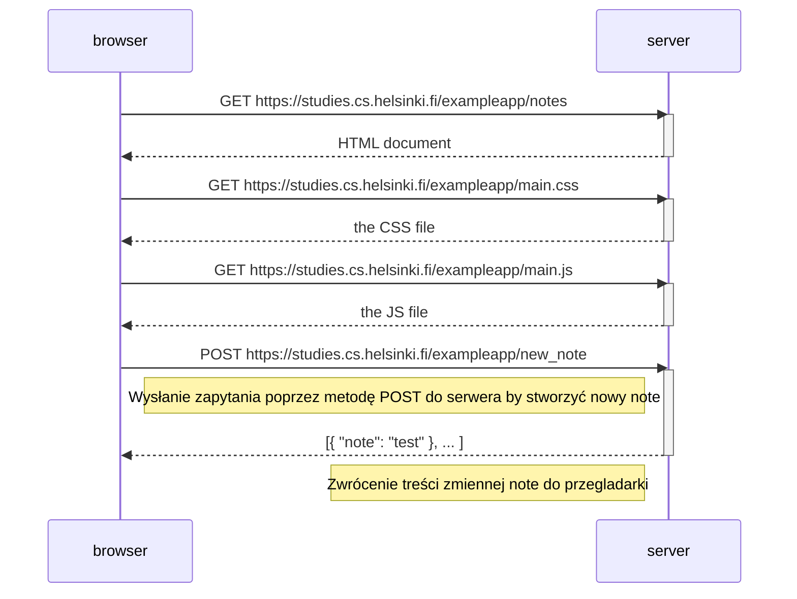

```mermaid
    sequenceDiagram
    participant browser
    participant server

    browser->>server: GET https://studies.cs.helsinki.fi/exampleapp/notes
    activate server
    server-->>browser: HTML document
    deactivate server

    browser->>server: GET https://studies.cs.helsinki.fi/exampleapp/main.css
    activate server
    server-->>browser: the CSS file
    deactivate server

    browser->>server: GET https://studies.cs.helsinki.fi/exampleapp/main.js
    activate server
    server-->>browser: the JS file
    deactivate server

    browser->>server: POST https://studies.cs.helsinki.fi/exampleapp/new_note
    activate server

    Note right of browser: Wysłanie zapytania poprzez metodę POST do serwera by stworzyć nowy note

    server-->>browser: [{ "note": "test" }, ... ]
    deactivate server

    Note left of server: Zwrócenie treści zmiennej note do przegladarki


```